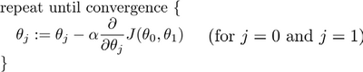
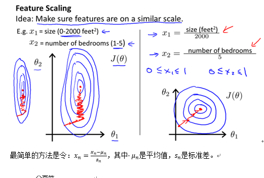
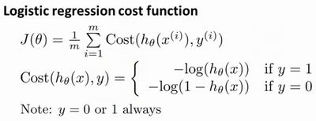
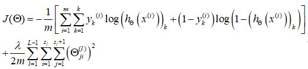

# 1 机器学习(Machine Learning)

## 1.1 定义

一个程序被认为能从经验E中学习，解决任务T，达到性能度量值P，当且仅当，有了经验E后，经过P评判，程序在处理T时的性能有所提升。

## 1.2 监督学习(Supervised Learning)

基本思想：数据集中的每个样本都有相应的“正确答案”

回归问题：通过回归来推出一个连续的输出

分类问题：目标是推出一组离散的结果

训练集(Training Set)

## 1.3 无监督学习(Unsupervised Learning)

学习策略，交给算法大量的数据，并让算法为我们从数据中找出某种结构

#  2 单变量线性回归(Linear Regression with One Variable)

## 2.1 问题定义

$$
h_\theta (x)={\theta}_0+{\theta}_1 x
$$

只含有一个特征/输入变量，这种问题叫做单变量线性回归问题

## 2.2 代价函数(Cost Function)

代价函数（平方误差函数）
$$
J(\theta_0,\theta_1)=\frac{1}{2m}\sum^m_{i=1}(h_\theta(x^{(i)})-y^{(i)})^2
$$
最小

目标：$ minimize_{\theta_0,\theta_1} J(\theta_0,\theta_1)$

## 2.3 梯度下降(Gradient Descent)

$\alpha$ 是学习率(learning rate)

# 3 多变量线性回归(Linear Regression with Multiple Variables)

## 3.1 多维特征(Multiple Features)

特征矩阵

## 3.2 多变量梯度下降(Gradient Descent for Multiple Variables)

$$
J(\theta_0,\theta_1,...,\theta_n)=\frac{1}{2m}\sum^m_{i=1}(h_\theta(x^{(i)})-y^{(i)})^2\\
h_\theta(x)=\theta^TX=\theta_0+\theta_1x_1+\theta_2x_2+..+\theta_nx_n
$$

## 3.3 梯度下降法实践1-特征缩放(Feature Scaling)

Idea: Make sure features are on a similar scale

## 3.4 梯度下降法实践2-学习率(Learning rate)

梯度下降算法的每次迭代受到学习率的影响，如果学习率$\alpha $过小，则达到收敛所需的迭代次数会非常高；如果学习率$\alpha $过大，每次迭代可能不会减小代价函数，可能会越过局部最小值导致无法收敛。

通常可以考虑尝试些学习率：$\alpha=0.01,0.03,0.1,0.3,1,3,10 $

## 3.5 特征和多项式回归(Features and Polynomial Regression)

## 3.6 正规方程(Normal Equation)

特征矩阵：$X $

训练集结果为向量：$y $

利用正规方程解出向量$\theta =(X^TX)^{-1}X^Ty$

| 梯度下降                          | 正规方程                                                     |
| --------------------------------- | ------------------------------------------------------------ |
| 需要选择学习率$ \alpha $          | 不需要                                                       |
| 需要多次迭代                      | 一次运算得出                                                 |
| 当特征数量       大时也能较好适用 | 需要计算$(X^TX)^{-1} $ 如果特征数量$n $较大则运算代价大，因为矩阵逆的计算时间复杂度为$O(n^2)$，通常来说当$n $小于10000 时还是可以接受的 |
| 适用于各种类型的模型              | 只适用于线性模型，不适合逻辑回归模型等其他模型               |

# 4 逻辑回归(Logistic Regression)

**输出值永远在0到1之间**

常用逻辑函数为S形函数(Sigmoid function):
$$
g(z)=\frac{1}{1+e^{-z}}
$$

**判定边界**：从而区分y值输出为0 or 1

## 4.1 代价函数

# 5 神经网络(Neural Networks)

​		每一个神经元都可以被认为是一个处理单元/神经核(processing unit/Nucleus)，它含有许多输入/树突(input/Dendrite)，并且有一个输出/轴突(output/Axon)。

​		神经网络是大量神经元相互链接并通过电脉冲来交流的一个网络。

输入层(input layer)-->隐藏层(hidden layer)-->输出层(output layer)

每一个$\alpha $ 都是由上一层所有的$x$ 和每一个$x$ 所对应的决定的。

## 5.1 前向传播算法(forward propagation)

从左到右的算法成为**前向传播算法(forward propagation)**

## 5.2 代价函数

m: 训练样本数

x: 一组输入信号

y: 一组输出信号

L: 神经网络层数

$S_t$ : 每层的neuron个数

$S_L$ : 最后一层处理单元的个数

代价函数：

## 5.3 反向传播算法(Backpropagation Algorithm)

为了计算代价函数的偏导数$\frac{\partial J(\theta)}{\partial \theta_{ij}^{(l)}}$，我们需要采用一种反向传播算法，也就是首先计算最后一层的误差，然后再一层一层反向求出各层的误差，直到倒数第二层。

# 6 聚类(clustering)

非监督学习算法

## 6.1 K-均值算法(K-Means Algorithm)

算法接受一个未标记的数据集，然后将数据聚类成不同的组

## 6.2 优化目标(Optimization Objective)

K-均值代价函数：
$$
J(c^{(1)},...,c^{(m)},\mu_1,...,\mu_K)=\frac{1}{m} \sum^m_{i=1}||X^{(i)}-\mu_c^{(i)}||^2
$$
$\mu_c^{(i)}$ 代表与$x^{(i)}$ 最近的聚类中心点。我们的优化目标便是找出使得代价函数最小的$c^{(1)},...,c^{(m)},\mu_1,...,\mu_K$ 

# 7 降维(Dimensionality Reduction)

## 7.1 动机一：数据压缩(Data Compression)

## 7.2 动机二：数据可视化(Visualization)

## 7.3 PCA算法(Principal Component Analysis Problem Formulation)

PCA最小化的是投射误差(Projected Error)，（垂直于红线投影，线性回归的误差则是垂直于横轴投影）

减少n维到k维：

1. 均值归一化。计算出所有特征的均值，然后令$x_j=x_j-\mu_j$ ，如果特征是在不同的数量级上，还需要将其除以标准差$\sigma^2$ 
2. 计算协方差矩阵： $\sum= \frac{1}{m}\sum^n_{i=1}(x^{(i)})(x^{(i)})^T $
3. 计算协方差矩阵的特征向量