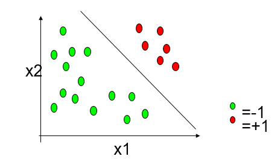
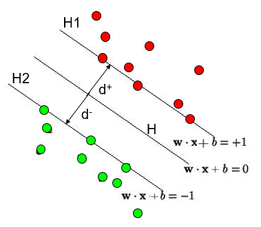
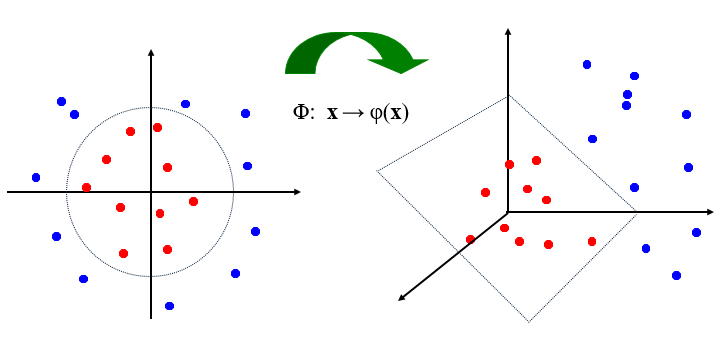

# SVM

支持向量机（Support Vector Machine）

## 1 线性SVM

给定训练样本集$(x^{(i)},y^{(i)}),i=1,...,m$ 
$$
y^{(i)}\in \{+1,-1\}
$$
找到一个线性函数（超平面）将两类样本分开：

超平面选择：最好能远离训练样本点

“正中间”的：鲁棒性最好，泛化能力最强

## 2 超平面定义

超平面H：
$$
w^Tx^{(i)}+b \geq +1, when \quad y^{(i)}=+1;\\
w^Tx^{(i)}+b \leq -1, when \quad y^{(i)}=-1;
$$
超平面H1、H2：
$$
H1: w^Tx^{(i)}+b=+1\\
H2：w^Tx^{(i)}+b=-1
$$
出现在H1、H2上的训练样本点，称为支持向量（Support Vectors）：
$$
\{x^{(i)}:|w^Tx^{(i)}+b|=1\}
$$

## 3 最大化间隔（Maximizing the margin）

$d+$ 代表$H$ 到正样本点（红点）最近的距离

$d-$ 代表$H$ 到负样本点（绿点）最近的距离

目标：

$d=(d+)+(d-)$ 的值最大

平面H到H1的距离：
$$
\frac {|w^Tx+b|}{||w||}=\frac {1}{||w||}
$$
平面H到H2的距离：
$$
\frac {|w^Tx+b|}{||w||}=\frac {1}{||w||}
$$
平面H1和H2的距离：
$$
\frac {2}{||w||}
$$
可将超平面的定义条件合并为：
$$
y^{(i)}(w^Tx^{(i)}+b)\geq +1, i=1,...,m
$$

为了最大化H1和H2之间的距离，需要寻找参数w和b，使得d最大
$$
\max _{w,b} \frac{2}{||w||}
$$
可以等价于：
$$
\min _{w,b} \frac {||w||^2}{2}
$$

## 4 支持向量

$$
f(x)=w^Tx+b=\sum _{i=1} ^{m} \alpha _i y^{(i)}(x^{(i)})^T x+b
$$

KKT条件：
$$
\alpha_i\ge 0\\
y^{(i)}f(x^{(i)})-1\ge0\\
\alpha_i[y^{(i)}f(x^{(i)})-1]=0
$$

若$\alpha_i =0$ ，对应的样本i不出现在$f(x)$ 中；

若$\alpha_i>0$ ，$y^{(i)}f(x^{i})=1$ ，对应的样本i位于最大间隔边界

## 5 非线性SVM

基本思想：将原始数据投射到某个更高维的空间，使得数据在该空间中线性可分

$\phi (x)$ 表示将x映射后的特征向量，划分超平面所对应的模型为：
$$
f(x)=w^T\phi(x)+b\\
\min _{w,b} \frac {||w||^2}{2}\\
s.t. y^{(i)}(w^T\phi(x^{(i)})+b)\ge1，i=1,...,m
$$

* 核函数
  $$
  k(x^{(i)},x^{(j)})=<\phi(x^{(i)}),\phi(x^{(j)})>=\phi(x^{(i)})^T\phi(x^{(j)})
  $$
  

求解对偶问题后得到原问题的解:
$$
f(x)=w^T\phi(x)+b\\
=\sum _{i=1} ^m \alpha_i y^{(i)} \phi(x^{(i)})^T \phi(x)+b\\
=\sum _{i=1} ^m \alpha_i y^{(i)} k(x^{(i)},x)+b
$$

## 6 SVM常用核函数

高斯核：
$$
K(x,y)=e^{-||x-y||^2 \over 2\sigma^2}=e^{-\gamma||x-y||^2}
$$
多项式核：
$$
K(x,y)=(x\cdot y+c)^p
$$
线性核（线性SVM）：
$$
K(x,y)=x^Ty
$$

## 7 软间隔（soft margin）

允许在一些样本上不满足约束

## 8 优化目标

* 最大间隔的同时，允许一些样本不满足约束
* 让不满足约束的样本尽可能少

$$
\min _{w,b} \frac {||w||^2}{2} +C \sum _{i=1} ^m cost(f(x^{(i)}),y^{(i)})
$$

