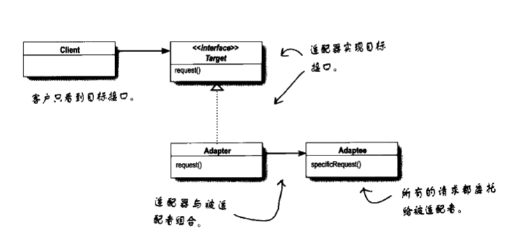
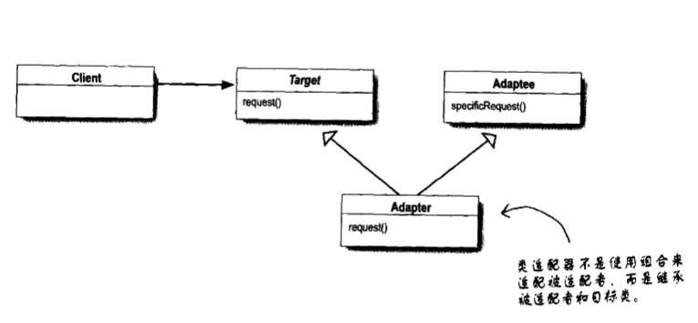
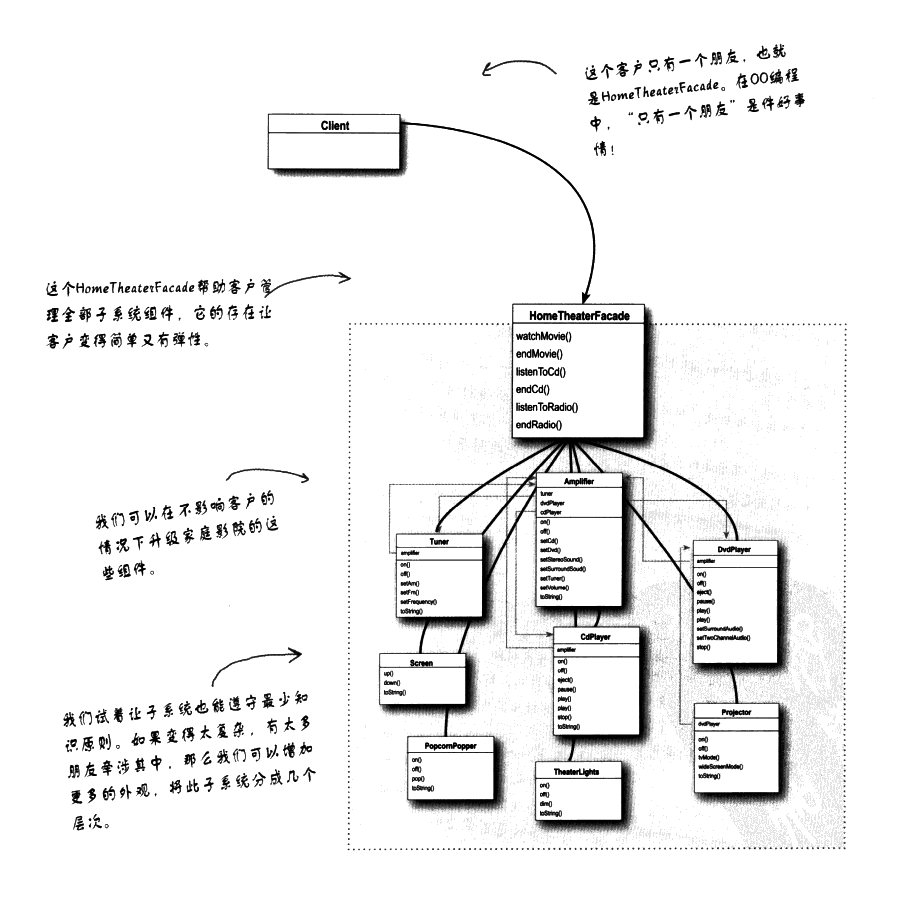

# 适配器模式与外观模式

OO适配器：将一个接口转换成另一个接口，以符合客户的期望

## 1  适配器模式

将一个类的接口，转换成客户期望的另一个接口。适配器让原本接口不兼容的类可以合作无间。

### 1.1 模式图

“对象”适配器：

使用对象组合，以修改的接口包装被适配者，这样，被适配者的任何子类，都可以搭配着适配器使用。

“类”适配器：

两者唯一的区别在于，一个使用继承的方式，一个使用组合的方式。

## 2 外观模式

将一个或数个类的复杂的一切都隐藏在背后，只显露出一个干净美好的外观。

外观只是提供更直接的操作，并未将原来的子系统阻隔起来。

外观没有“封装”子系统的类，它只是提供简化的接口。

特征：提供简化的接口的同时，依然将系统完整的功能暴露出来，以供需要的人使用。

**外观的意图：简化接口；适配器的意图：将接口转换成不同接口**

定义：提供了一个统一的接口，用来访问子系统中的一群接口。外观定义了一个高层接口，让子系统更容易使用。

