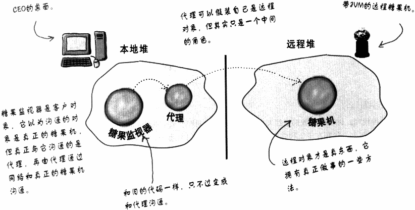
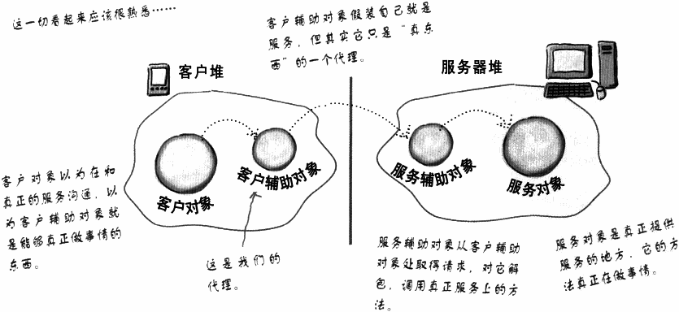
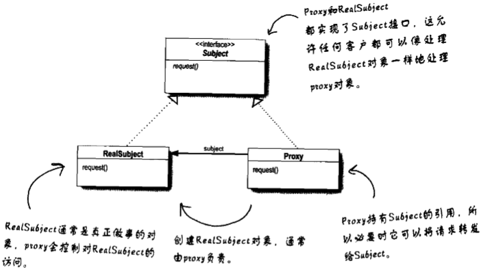
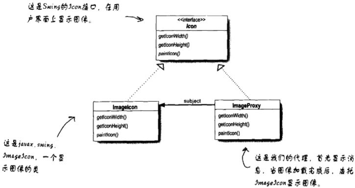
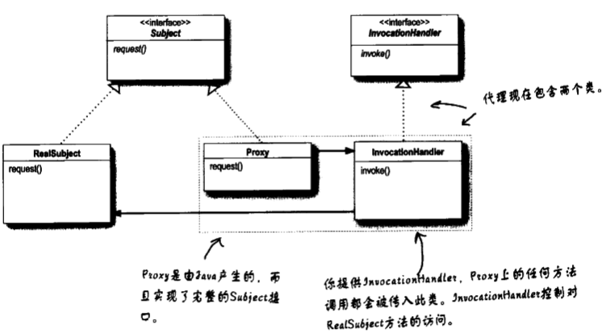
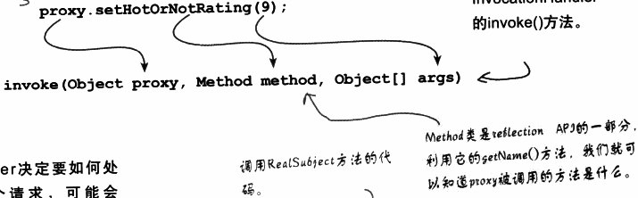

# 代理模式

控制对象访问

将监视器和糖果机分离，不在同一个JVM上面执行，能够在桌面上远程监控这些机器。

必须确定糖果机能够通过网络接受请求并且提供服务，也需要让监视器有办法取得代理对象的引用。

## 远程代理角色




客户对象所做的就像是在做远程方法调用，但其实只是调用本地堆中的“代理”对象上的方法，再由代理处理所有网络通信的底层细节。

## 将远程代理加到糖果机的监视代码中

1. 先了解一下RMI
2. 把GumballMachine编程远程调用服务，提供一些可以被远程调用的方法
3. 创建一个能和远程的GumballMachine沟通的代理，需要用到RMI。最后再结合监视系统，CEO就可以监视任何数量的远程糖果机了。



### 1 方法调用过程

1. 客户对象调用客户辅助对象的doBigThing()方法
2. 客户辅助对象打包调用信息（变量、方法名称等），然后通过网络将它运给服务辅助对象
3. 服务辅助对象把来自客户辅助对象的信息解包，找出被调用的方法（以及在哪个对象内），然后调用真正的服务对象上的真正方法。
4. 服务对象上的方法被调用，将结果返回给服务辅助对象
5. 服务辅助对象把调用的返回信息打包，然后通过网络运回给客户辅助对象
6. 客户辅助对象把返回值解包，返回给客户对象。对于客户来说，这是完全透明的。

### 2 制作远程服务

以下步骤将一个普通的对象变成可以被远程客户调用的远程对象。

步骤一：制作远程接口

> 远程接口定义出可以让客户远程调用的方法。
>
> 客户将用它作为服务的类类型。
>
> Sub和实际的服务都实现此接口。

步骤二：制作远程的实现

> 做实际工作的类，为远程接口中定义的远程方法提供了真正的实现。
>
> 这就是客户真正想要调用方法的对象

步骤三：利用rmic产生的stub和skeleton

> 这就是客户和服务的辅助类。
>
> 不需要自己创建这些类，甚至连生成它们的代码都不用看，因为当你运行rmic工具时，这都会自动处理。可以在JDK中找到rmic。

步骤四：启动RMI registry

> rmiregistry就像是电话簿，客户可以从中查到代理的位置(也就是客户的stub helper对象)

步骤五：开始远程服务

> 必须让服务对象开始运行。
>
> 服务实现类会去实例化一个服务的实例，并将这个服务注册到RMI registry。
>
> 注册之后，这个服务就可以供客户调用了。

#### 2.1 步骤一：制作远程接口

1. 扩展java.rmi.Remote

   ```java
   public interface MyRemote extends Remote{
       
   }
   ```

2. 声明所有的方法都会抛出RemoteException

   > 客户会调用实现远程接口的Stub上的方法，而Stub底层用到了网络和I/O，所以各种事情都可能发生。
   >
   > 客户必须认识到风险，通过处理或声明远程异常来解决。
   >
   > 如果接口中的方法声明了异常，任何在接口类型的引用上调用方法的代码也必须处理或声明异常。

   ```java
   import java.rmi.*;//Remote接口在java.rmi中
   public interface MyRemote extends Remote{
       //每个方法中声明RemoteException
       public String sayHello() throws RemoteException;
   }
   
   ```

3. 确定变量和返回值是属于原语(primitive)类型或者可序列化(Serializable)类型

   > 远程方法的变量和返回值，必须属于原语类型或Serializable类型。
   >
   > 远程方法的变量必须被打包并通过网络运送，这要靠序列化来完成。
   >
   > 如果使用原语类型、字符串和许多API中内定的类型（包括数组和集合），不会有问题。
   >
   > 如果传送自己定义的类，就必须保证你的类实现了Serializable。

   

   

#### 2.2 步骤二：制作远程实现

1. 实现远程接口

   > 服务必须实现远程接口，也就是客户将要调用的方法的接口。

   ```java
   public class MyRemoteImpl extends UnicastRemoteObject implements MyRemote{
       public String sayHello(){
           return "Server says, 'Hey'";
       }
       //类中更多的代码
   }
   ```

2. 扩展UnicastRemoteObject

   > 要成为远程服务对象，你的对象需要某些“远程的”功能。
   >
   > 最简单的方法是扩展java.rmi.server.UnicastRemoteObject，让超类帮你做这些工作。

   ```java
   public class MyRemoteImpl extends UnicastRemoteObject implements MyRemote{
       
   }
   ```

3. 设计一个不带变量的构造器，并声明RemoteException

   ```java
   public MyRemoteImpl() throws RemoteException{
       
   }
   ```

4. 用RMI Registry注册此服务

   > 要让远程服务能被远程客户调用。那就要将此服务实例化，然后放进RMI registry中（要先确定RMI Registry正在运行，否则注册会失败）。
   >
   > 注册这个对象时，RMI系统其实注册的是stub，因为这是客户真正需要的。注册服务使用了java.rmi.Naming类的静态rebind()方法。

   ```java
   try{
       MyRemote service=new MyRemoteImpl();
       Naming.rebind("RemoteHello",service);
   }catch(Exception ex){...}
   ```

#### 2.3 步骤三：产生Stub和Skeleton

在远程实现类（不是远程接口）上执行rmic

#### 2.4 步骤四：执行rmiregistry

开启一个终端，启动rmiregistry。确定启动目录必须可以访问你的类。

#### 2.5 步骤五：启动服务

开启一个终端，启动服务

### 3 服务器端完整代码

远程接口：

```java
import java.rmi.*;
public interface MyRemote extends Remote{
    public String sayHello() throws RemoteException;
}
```

远程服务（实现）:

```java
import java.rmi.*;
import java.rmi.server.*;
public class MyRemoteImpl extends UnicastRemoteObject implements MyRemote{
    public String sayHello()
    {
        return "Server says, 'Hey'";
    }
    
    public MyRemoteImpl() throws RemoteException{
        
    }
    
    public static void main(String[] args)
    {
        try{
            MyRemote service=new MyRemoteImpl();
            Naming.rebind("RemoteHello",service);
        }catch(Exception ex)
        {
            ex.printStackTrace();
        }
    }
}
```

### 4 客户端取得stub对象

```java
MyRemote service=(MyRemote) Naming.lookup("rmi://127.0.0.1/RemoteHello");
```


#### 4.1 工作方式

1. 客户到RMI registry中寻找

   Naming.lookup("rmi://127.0.0.1/RemoteHello");

2. RMI registry返回Stub对象

   然后RMI会自动对stub反序列化。

   在客户端必须有stub类（由rmic为你产生），否则stub就无法被反序列化。

3. 客户调用stub的方法，就像stub就是真正的服务对象一样

#### 4.2 完整的客户代码

```java
import java.rmi.*;

public class MyRemoteClient{
    public static void main(String[] args)
    {
        new MyRemoteClient().go();
    }
    
    public void go(){
        try{
            MyRemote service=(MyRemote) Naming.lookup("rmi://127.0.0.1/RemoteHello");
            String s=service.sayHello();
            System.out.println(s);
        }catch(Exception ex)
        {
            ex.printStackTrace();
        }
    }
}
```

### 5 让GumballMachine准备好当一个远程服务

```java
import java.rmi.*;

public interface GumballMachineRemote extends Remote{
    public int getCount() throws RemoteException;
    public String getLocation() throws RemoteException;
    public State getState() throws RemoteException;
    //所有返回值必须是原语类型或可序列化的
    //需要将State类可序列化
}
```

将State类可序列化:

```java
import java.io.*;
public interface State extends Serializable{
    public void insertQuarter();
    public void ejectQuarter();
    public void turnCrank();
    public void dispense();
}
```

* 只要扩展Serializable接口（此接口没有方法）。现在所有子类中的State就可以在网络上传送了。

当我们不希望整个糖果机都被序列化并随着State对象一起传送时，可以如下修正：

```java
public class NoQuarterState implements State{
    transient GumballMachine gumballMachine;
    //实例变量上加上transient关键字，这样就告诉JVM不要序列化这个字段
}
```

让GumballMachine类能够被当成服务使用，必须确定GumballMachine实现GumballMachineRemote接口：

```java
import java.rmi.*;
import java.rmi.server.*;
public class GumballMahcinen extends UnicastRemoteObject implements GumballMachineRemote{
   //构造器需要抛出RemoteException异常，因为超类是这么做的
    public GumballMachine(String location,int numberGumballs) throws RemoteException{
        //这里有代码
    }
    public int getCount()
    {
        return count;
    }
    public State getState(){
        return state;
    }
    public String getLocation(){
        return location;
    }
}
```


## 代理模式定义

为另一个对象提供一个替身或占位符以控制对这个对象的访问


* 远程代理控制访问远程对象
* 虚拟代理控制访问创建开销大的资源
* 保护代理基于权限控制对资源的访问

### 1 类图



   

Subject为RealSubject和Proxy提供了接口，通过实现同一接口，Proxy在RealSubject出现的地方取代它。

RealSubject是真正做事的对象，它是被proxy代理和控制访问的对象。

Proxy持有RealSubject的引用。在某些例子中，Proxy还会负责RealSubject对象的创建与销毁。客户和RealSubject的交互都必须通过Proxy。因为Proxy和RealSubject实现相同的接口（Subject），所以任何用到RealSubject的地方，都可以用Proxy取代。Proxy也控制了对RealSubject的访问。

## 虚拟代理

为创建开销大的对象的代表。虚拟代理经常直到我们真正需要一个对象的时候才创建它。

### 1 CD封面虚拟代理



#### 1.1 ImageProxy工作原理

1. ImageProxy首先创建一个ImageIcon，然后开始从网络URL上加载图像
2. 在加载过程中，ImageProxy显示"CD封面加载中，请稍后...."
3. 当图像加载完毕，ImageProxy把所有方法调用委托给真正的ImageIcon，这些方法包括了paintIcon()、getWidth()和getHeight()。
4. 如果用户请求新的图像，我们就创建新的代理，重复这样的过程。

#### 1.2 编写ImageProxy

```java
class ImageProxy implements Icon{
    ImageIcon imageIcon;
    URL imageURL;
    Thread retrievalThread;
    boolean retrieving =false;
    public ImageProxy(URL url){
        imageURL=url;
    }
    
    public int getIconWidth()
    {
        if(imageIcon!=null)
        {
            return imageIcon.getIconWidth();
        }
        else
        {
            return 800;
        }
    }
    public int getIconHeight(){
        if(imageIcon!=null){
            return imageIcon.getIconHeight();
        }
        else{
            return 600;
        }
    }
    
    public void paintIcon(final Component c, Graphics g,int x, int y )
    {
        if(imageIcon!=null)
        {
            imageIcon.paintIcon(c,g,x,y);
        }
        else
        {
            g.drawString("Loading CD cover, please wait...",x+300,y+190);
            if(!retrieving)
            {
                retrieving=true;
                retrievalThread=new Thread(new Runable(){
                    public void run(){
                        try{
                            imageIcon=new ImageIcon(imageURL,"CD Cover");
                            c.repaint();
                        }catch(Exception e){
                            e.printStackTrace();
                        }
                    }
                });
                retrievalThread.start();
            }
        }
    }
}
```

What have we done?

1. 我们创建了一个用来现实的ImageProxy。paintIcon()方法会被调用，而ImageProxy会产生线程取得图像，并创建ImageIcon.
2. 在某个时间点，图像被返回，ImageIcon被完整实例化
3. 在ImageIcon被创建后，下次调用到paintIcon()时，代理就委托ImageIcon进行。

## 保护代理

java.lang.reflect包中有自己的代理支持，利用这个包可以在运行时动态地创建一个代理类，实现一个或多个接口，并将方法的调用转发到你说指定的类。

实际的代理类是在运行时创建的，称为：动态代理




保护代理：根据访问权限决定客户可否访问对象的代理。

### 1 为PersonBean创建动态代理

#### 1.1 步骤一：创建两个InvocationHandler

> InvocationHandler实现了代理的行为，Java负责创建真实代理类和对象。

写两个InvocationHandler（调用处理器），其中一个给拥有者使用，另一个给非拥有者使用。

1. 假设proxy的setHotOrNotRating()方法被调用

2. proxy会接着调用InvocationHandler的invoke()方法

   

3. handler决定要如何处置这个请求，可能会转发给RealSubject。handler到底是如何决定的呢？

```java
import java.lang.reflect.*;

//所有调用处理器都实现InvocationHandler接口
public class OwnerInvocationHandler implements InvocationHandler{
    PersonBean person;
    
    //我们将person传入构造器，并保持它的引用
    public OwnerInvocationHandler(PersonBean person)
    {
        this.person=person;
    }
    
    //每次proxy的方法被调用，就会导致Proxy调用此方法
    public Object invoke(Object proxy,Method method,Object[] args) throws IllegalAccessException
    {
        try{
            //如果方法是一个setter,我们就调用person内的方法
            if(method.getName().startsWith("get")){
                return method.invoke(person,args);
            }
            //否则，如果方法是setHotOrNotRating()，我们就抛出IllegalAccessException表示不允许
            else if(method.getName().equals("setHotOrNotRating")){
                thorw new IlleagalAccessException();
            }
            //因为我们是拥有者，所以任何其他set方法都可以，我们就在真正的主题上调用它
            else if(method.getName().startsWith("set")){
                return method.invoke(person,args);
            }
        }catch(InvocationTargetException e)
        {
            e.printStackTrace();
        }
        return null;
    }
}
```


#### 1.2 步骤二：写代码创建动态代理

> 需要写一些代码产生代理类，并实例化它。

要创建一个代理，将它的方法调用转发给OwnerInvocationHandler。

代码如下：

```java
PersonBean getOwnerProxy(PersonBean person)
{
    //利用Proxy类的静态newProxyInstance方法创建代理
    //将personBean的类载入器当做参数
    return (PersonBean) Proxy.newProxyInsntance(person.getClass().getClassLoader(),person.getClass().getInterfaces(),new OwnerInvocationHandler(person));
}
```


#### 1.3 步骤三：利用适当的代理包装任何PersonBean对象

## 其他代理

1. 防火墙代理（Firewall Proxy)

   > 控制网络资源的访问，保护主题免于“坏客户”的侵害

2. 智能引用代理（Smart Reference Proxy)

   > 当主题被引用时，进行额外的动作，例如计算一个对象被引用的次数

3. 缓存代理(Caching Proxy)

   > 为开销大的运算结果提供暂时存储：它也允许多个客户共享结果，以减少计算或网络延迟

4. 同步代理（Synchronization Proxy）

   > 多线程的情况下为主题提供安全的访问

5. 复杂隐藏代理(Complexity Hiding Proxy)

   > 用来隐藏一个类的复杂集合的复杂度，并进行访问控制。有时候也称为外观代理（Facade Proxy）。
   >
   > 复杂隐藏代理和外观模式是不一样的，因为代理控制访问，而外观模式只提供另一组接口、

6. 写入时复制代理（Copy-On-Write Proxy)

   > 用来控制对象的复制，方法是延迟对象的复制，直到客户真的需要为止。（虚拟代理的变体）

## 总结

代理模式：为另一个对象提供代表，以便控制客户对对象的访问，管理访问的方式有许多种

远程代理：管理客户与远程对象之间的交互

虚拟代理：控制访问实例化开销大的对象

保护代理：基于调用者控制对对象方法的访问

