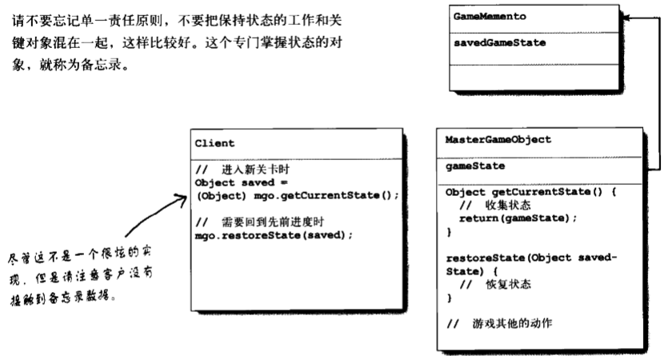

#  Basic Pattern

## 装饰者

包装一个对象，以提供新的行为

## 状态

封装了基于状态的行为，并使用委托在行为之间切换

## 迭代器

在对象的集合之中游走，而不暴露集合的实现

## 外观

简化一群类的接口

## 策略

封装可以互换的行为，并使用委托来决定要使用哪一个

## 代理

包装对象，以控制对此对象的访问

## 工厂方法

由子类决定要创建的具体类是哪一个

## 适配器

封装对象，并提供不同的接口

## 观察者

让对象能够在状态改变时被通知

## 模板方法

由子类决定如何实现一个算法中的步骤

## 组合

客户用一致的方式处理对象集合和单个对象

## 单件

确保有且仅有一个对象被创建

## 抽象工厂

允许客户创建对象的家族，而无需指定他们的具体类

## 命令

封装请求成为对象

## 桥接模式（Bridge Pattern）

不只改变你的实现，也改变你的抽象

## 生成器模式（Builder Pattern）

封装一个产品的构造过程，并允许按步骤构造

## 责任链模式（Chain of Responsibility Pattern）

一个以上的对象有机会处理某个请求时

## 蝇量模式（Flyweight Pattern）

让某一个类的一个实例能用来提供许多“虚拟实例”

优点：

1. 减少运行时对象实例的个数，节省内存
2. 将许多“虚拟”对象的状态集中管理

缺点：

1. 一旦实现了它，单个逻辑实例将无法拥有独立而不同的行为
2. 一个类有许多的实例，而这些实例能被同一方法控制的时候

## 解释器模式（Interpreter Pattern）

为语言创建解释器

## 中介者模式（Mediator Pattern）

集中相关对象之间复杂的沟通和控制方式

## 备忘录模式（MementoPattern）

需要让对象返回之前的状态时

1. 储存系统关键对象的重要状态
2. 维护关键对象的封装

优点：

1. 将被储存的状态放在外面，不要和关键对象混在一起，这可以帮助维护内聚
2. 保持关键对象的数据封装
3. 提供了容易实现的恢复能力

缺点：

1. 用于储存状态
2. 储存和恢复状态的过程可能相当耗时

## 访问者模式（Visitor Pattern）

