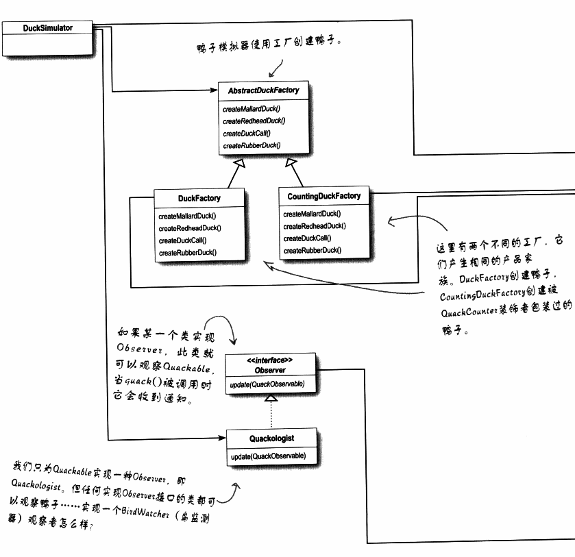
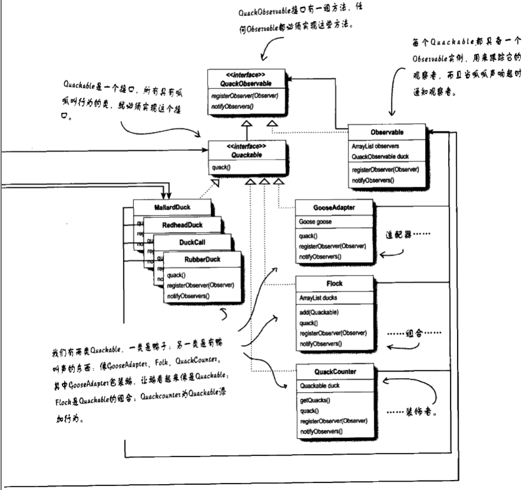

# 复合模式

模式通常被一起使用，并被组合在同一个设计解决方案中。

复合模式在一个解决方案中结合两个或多个模式，以解决一般或重复发生的问题。

## 如何解决问题

从一大堆Quackable开始

1. 有一只鹅出现了，它希望自己像一个Quackable

   > 利用适配器模式，将鹅适配成Quackable，然后就可以调用鹅适配器的quack()方法来让鹅咯咯叫

2. 然后，呱呱叫学家决定要计算呱呱叫声的次数

   > 装饰者模式，添加一个名为QuackCounter的装饰者。它用来追踪quack()被调用的次数，并将调用委托给它所装饰的Quackable对象

3. 但是，呱呱叫学家担心他们忘了加上QuackCounter装饰者

   > 所以使用抽象工厂模式创建鸭子。从此以后，当他们需要鸭子时，就直接跟工厂要，工厂会给他们装饰过的鸭子。
   >
   > （如果他们想取得没装饰的鸭子，用另一个鸭子工厂就可以！）

4. 又是鸭子，又是鹅，又是quackable的......管理困扰

   > 需要使用组合模式，将许多quackable集结成一个群。这个模式也允许群中有群，以便让呱呱叫家来管理鸭子家族。在实现中通过使用ArrayList中的java.util的迭代器而使用了迭代器模式

5. 当任何呱呱声响起时，呱呱叫学家都希望能被告知

   > 使用观察者模式，让呱呱叫学家注册成为观察者。当呱呱声响起时，呱呱声叫学家就会被通知。在这个实现中，我们再度用到了迭代器。呱呱叫学家不仅可以当某个鸭子的观察者，甚至可以当一整群的观察者。

## 类图

## MVC（model-view-controller)

### View

用来呈现模型。视图通常直接从模型中取得它需要显示的状态与数据。

### Controller

取得用户的输入并解读其对模型的意思

### Model

模型持有所有的数据、状态和程序逻辑。模型没有注意到视图和控制器，虽然它提供了操纵和检索状态的接口，并发送状态改变通知给观察者。

