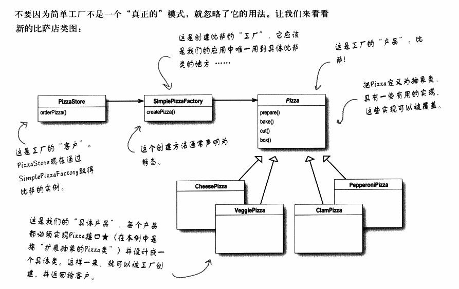

## 工厂模式

烘烤OO的精华

工厂模式：定义了一个创建对象的接口，但由子类决定要实例化的类是哪一个。工厂方法让类把实例化推迟到子类。

**设计原则（依赖倒置原则）：要依赖抽象，不要依赖具体类**

抽象工厂模式：提供一个接口，用于创建相关或依赖对象的家族，而不需要明确指定具体类。


### 1 建立一个简单比萨工厂

先从工厂本身开始。我们要定义一个类，为所有比萨封装创建对象的代码。

```java
public class SimplePizzaFactory{
    //首先，在这个内定义一个createPizza()方法。
    //所有客户用这个方法来实例化新对象
    public Pizza createPizza(String type)
    {
        Pizza pizza=null;
        
        if(type.equals("cheese"))
        {
            pizza=new CheesePizza();
        }
        else if(type.equals("pepperoni"))
        {
            pizza=new PepperoniPizza();
        }
        else if(type.equals("clam"))
        {
            pizza=new ClamPizza();
        }
        else if(type.equals("veggie"))
        {
            pizza=new VeggiePizza();
        }
        return pizza;
    }
}
```


orderPizza()方法是该factory的客户，可能还有PizzaShopMenu(比萨店菜单)类，会利用这个工厂来取得比萨的价钱和描述。可能还有一个HomeDelivery(宅急送)类，会以与PizzaShop类不同的方式来处理比萨。

总而言之，SimplePizzaFactory可以有许多的客户。

把创建比萨的代码包装进一个类，当以后实现改变时，只需修改这个类即可。


另一种工厂形式：静态工厂

优点缺点：

> 利用静态方法定义一个简单的工厂，这是很常见的技巧，常被称为静态工厂。为何使用静态方法？因为不需要使用创建对象的方法来实例化对象。但请记住，这也有缺点，不能通过继承来改变创建方法的行为。

### 2 重做PizzaStore类

现在是仰仗工厂来为我们创建比萨

```java
public class PizzaStore{
    SimplePizzaFactory factory;//加一个SimplePizzaFactory的引用
    public PizzaStore(SimplePizzaFactory factory)
    {
        this.factory=factory;
    }
    
    public Pizza orderPizza(String type)
    {
        Pizza pizza;
        
        //把new操作符替换成工厂对象的创建方法。这里不再使用具体实例化
        pizza= factory.createPizza(type);
        
        pizza.prepare();
        pizza.bake();
        pizza.cut();
        pizza.box();
        return pizza;
    }
    //这里是其他方法
}
```
### 3 简单工厂模式实现图



### 4 加盟比萨店

每家加盟店都可能想要提供不同风味的比萨（比如说纽约、芝加哥、加州）

能够建立一个框架，把加盟店和创建比萨捆绑在一起的同时又保持一定的弹性。

在我们稍早的SimplePizzaFactory代码之前，制作的比萨的代码绑在PizzaStore里，但这么做却没有弹性。

### 5 给比萨店使用的框架

有个做法可让比萨制作活动局限于PizzaStore类，而同时又能让这些加盟店依然可以自由地制作该区域的风味。

就是把createPizza()方法放回到PizzaStore中，不过要把它设置成“抽象方法”，然后为每个区域风味创建一个PizzaStore的子类。

首先，PizzaStore改变：

```java
public abstract class PizzaStore{
    public Pizza orderPizza(String type)
    {
        Pizza pizza;
        //createPizza()方法从工厂对象移回PizzaStore
        pizza=createPizza(type);
        pizza.prepare();
        pizza.bake();
        pizza.cut();
        pizza.box();
        
        return pizza;        
    }
    //“工厂方法”现在是抽象的
    protected abstract Pizza createPizza(String type);
}
```

现在已经有一个PizzaStore作为超类；让每个域类型(NYPizzaStore、ChicagoPizzaStore、CaliforniaPizzaStore)都继承这个PizzaStore，每个子类各自决定如何制造比萨。

```java
public class NYStylePizzaStore extends PizzaStore{
    public Pizza createPizza(String type)
    {
        //独属于该加盟店的方法
        if(type.equals("cheese"))
        {
            return new NYStyleCheesePizza();
        }
        else if(type.equals("veggie"))
        {
            return new NYStyleVeggiePizza();
        }
        else
            return null;
    }
}

public class ChicagoStylePizzaStore extends PizzaStore{
    public Pizza createPizza(String type)
    {
        //独属于该加盟店的方法
    }
}
```

orderPizza()方法对Pizza对象做了许多事情（例如：准备、烘烤、切片、装盒），但由于Pizza对象是抽象的，orderPizza()并不知道哪些实际的具体类参与进来了。换句话说，这就是解耦(decouple)！

### 6 比萨本身

```java
public abstract class Pizza{
    String name;
    String dough;
    String sauce;
    ArrayList toppings=new ArrayList();
    
    void prepare(){
        
    }
    void bake(){
        
    }
    void cut(){
        
    }
    void box()
    {
        
    }
    public String getName()
    {
        return name;
    }
}
```

具体子类：纽约、芝加哥风味的芝士比萨

```java
public class NYStyleCheesePizza extends Pizza{
    public NYStyleCheesePizza(){
        name="NY Style Sauce and Cheese Pizza";
        dough="Thin Crust Dough";
        sauce="Marinara Sauce";
        
        toppings.add("Grated Reggiano Cheese");
    }
}

public class ChicagoStyleCheesePizza extends Pizza{
    public ChicagoStyleCheesePizza()
    {
        name="Chicago Style Deep Dish Cheese Pizza";
        dough="Extra Thick Crust Dough";
        sauce="Plum Tomato Sauce";
        
        toppings.add("Shredded Mozzarella Cheese");
    }
    
    void cut()
    {
        
    }
}
```

### 7 测试代码

```java
public class PizzaTestDrive{
    public static void main(String[] args)
    {
        PizzaStore nyStore=new NYPizzaStore();
        PizzaStore chicagoStore=new ChicagoPizzaStore();
        
        Pizza pizza=nyStore.orderPizza("cheese");
        System.out.println("Ethan ordered a "+pizza.getName()+"\n");
        pizza=chicagoStore.orderPizza("cheese");
        System.out.println("Joel ordered a "+pizza.getName()+"\n");
    }
}
```

### 8 建造原料工厂

保证比萨的原料质量

先为工厂定义一个接口，这个接口负责创建所有的原料：

```java
public interface PizzaIngredientFactory{
    public Dough createDough();
    public Sauce createSauce();
    public Cheese createCheese();
    public Veggies[] createVeggies();
    public Pepperoni createPepperoni();
    public Clams createClam();
}
```

#### 8.1 创建纽约原料工厂

这工厂专精于大蒜番茄酱料、Reggiano干酪、新鲜蛤蜊

```java
public class NYPizzaIngredientFactory implements PizzaIngredientFactory{
    public Dough createDough()
    {
        return new ThinCrustDough();
    }
    public Sauce createSauce()
    {
        return new MarinaraSauce();
    }
    public Cheese createCheese()
    {
        return new ReggianoCheese();
    }
    public Veggies[] createVeggies()
    {
        Veggies veggies[]={new Garlic(), new Onion(),new Mushroom(), new RedPepper()};
        return veggies;
    }
    public Pepperoni createPepperoni()
    {
        return new SlicePepperoni();
    }
    public Clams createClam()
    {
        return new FreshClams();
    }
}
```