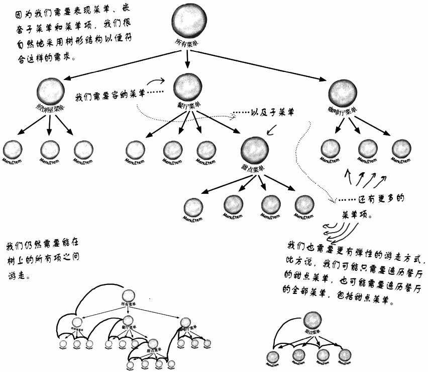
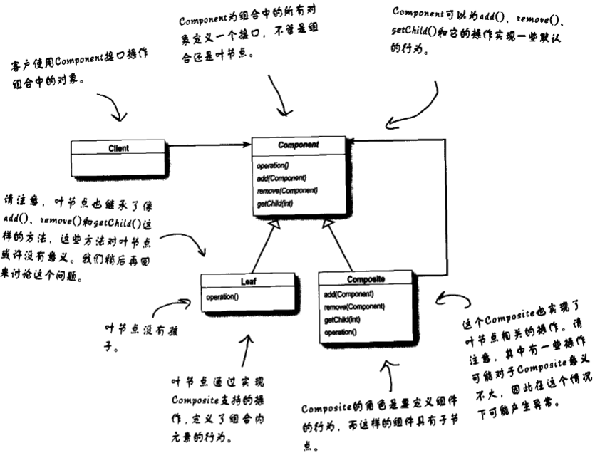

# 组合模式

管理菜单的问题已经到了一个迭代器无法解决的新维度。

## 1 定义组合模式

允许你将对象组合成树形结构来表现“整体/部分”层次结构。组合能让客户以一致的方式处理个别对象以及对象组合。

​        组合模式让我们能用树形方式创建对象的结构，树里面包含了组合以及个别的对象。使用组合结构，我们能把相同的操作应用在组合和个别对象上。在大多数情况下，我们可以忽略对象组合和个别对象之间的差别。

### 1.1 组合模式类图

