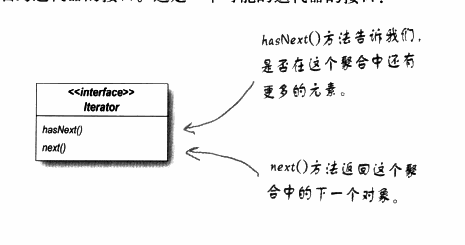
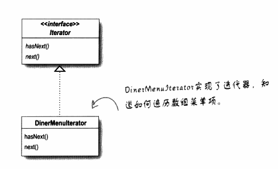
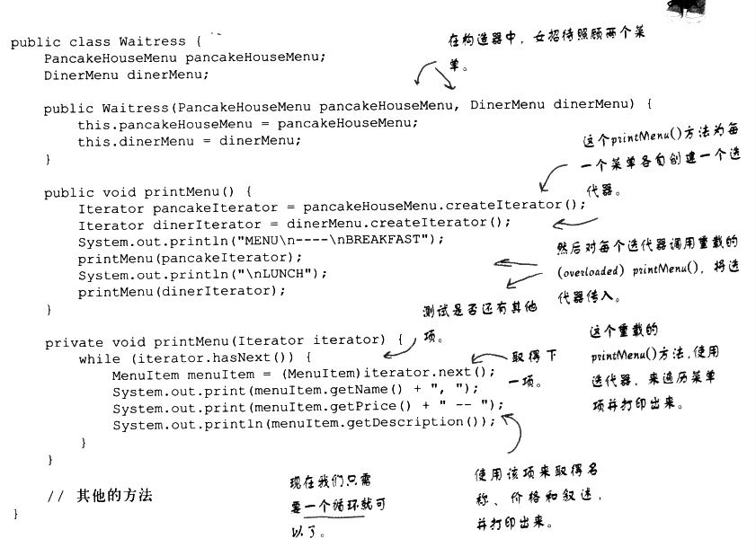
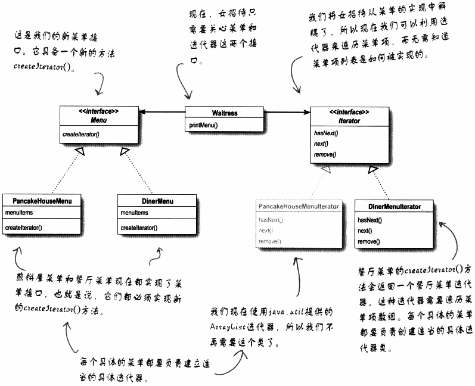

# 迭代器模式

能让客户遍历你的对象而又无法窥视你存储对象的方式；学习如何创建一些对象超集合(super collection)

## 1 餐厅和煎饼屋合并

一个用ArrayList实现菜单，一个用数组实现菜单

共同的菜单项：

```java
public class MenuItem{
    String name;
    String description;
    boolean vegetarian;
    double price;
    
    public MenuItem(String name,String description,boolean vegetarian,double price)
    {
        this.name=name;
        this.description=description;
        this.vegetarian=vegetarian;
        this.price=price;
    }
    ...
}
```


1. 要遍历早餐项，我们需要使用ArrayList的size()和get()方法

   ```java
   for(int i=0;i<breakfastItems.size();i++){
       MenuItem menuItem=(MenuItem)breakfastItems.get(i);
   }
   ```

   

2. 要遍历午餐项，我们需要使用数组的length字段和中括号

   ```java
   for(int i=0;i<lunchItems.length;i++){
       MenuItem menuItem=lunchItems[i];
   }
   ```

3. 创建一个迭代器(Iterator)，利用它来封装“遍历集合内的每个对象的过程”

   ```java
   Iterator iterator=breakfastMenu.createIterator();
   while(iterator.hasNext()){
       MenuItem menuItem=(MenuItem)iterator.next();
   }
   ```

   客户只需要调用hasNext()和next()；而迭代器会暗中调用ArrayList的get()

4. 在数组上同理：

   ```java
   Iterator iterator=lunchMenu.createIterator();
   while(iterator.hasNext())
   {
       MenuItem menuItem=(MenuItem)iterator.next();
   }
   ```

   迭代器会暗中使用数组的下标。

## 2 迭代器模式

### 2.1 迭代器实现

依赖于一个名为迭代器的接口：



有了这个接口，就可以为各种对象集合实现迭代器：数组、列表、散列表等等


如果想为数组实现迭代器，以便使用在DinerMenu中:



代码实现如下：

预先定义迭代器接口：

```java
public interface Iterator{
    boolean hasNext();
    Object next();
}
```

实现具体的迭代器，为餐厅菜单服务：

```java
public class DinerMenuIterator implements Iterator{
    MenuItem[] items;
    int position=0;
    public DinerMenuIterator(MenuItem[] items){
        this.items=items;
    }
    public Object next(){
        MenuItem menuItem=items[position];
        position=position+1;
        return menuItem;
    }
    public boolean hasNext(){
        if(position>=items.length||items[position]==null){
            return false;
        }
        else{
            return true;
        }
    }
}
```

利用它来改写餐厅菜单，我们只需加入一个方法创建一个DinerMenuIterator，并将它返回给客户。

```java
public class DinerMenu{
    static final int MAX_ITEMS=6;
    int numberOfItems=0;
    MenuItem[] menuItems;
    
    //构造器在这里
    
    //addItem在这里
    
    public Iterator createIterator(){
        return new DinerMenuIterator(menuItems);
    }
    //菜单其他方法
}
```


修正女招待的代码：



### 2.2 设计原理图



**针对接口编程**

### 2.3 定义迭代器模式

​        提供一种方法顺序访问一个聚合对象中的各个元素，而又不暴露其内部的表示。

​        把游走的任务放在迭代器上，而不是聚合上。这样简化了聚合的接口和实现，也让责任各得其所。不仅让聚合的接口和实现变得更简洁，也可以让聚合更专注在它所应该专注的事情上面（也就是管理对象集合），而不必去理会遍历的事情。


设计原则：**一个类应该只有一个引起变化的原因**。

内聚：度量一个类或模块紧密地达到单一目的或责任。

高内聚：一个模块或一个类被设计成只支持一组相关的功能