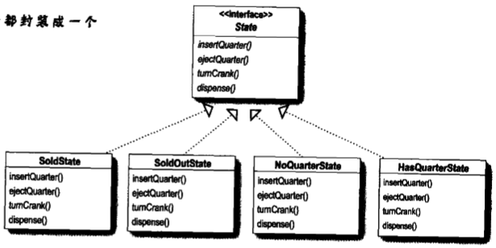
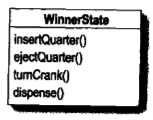
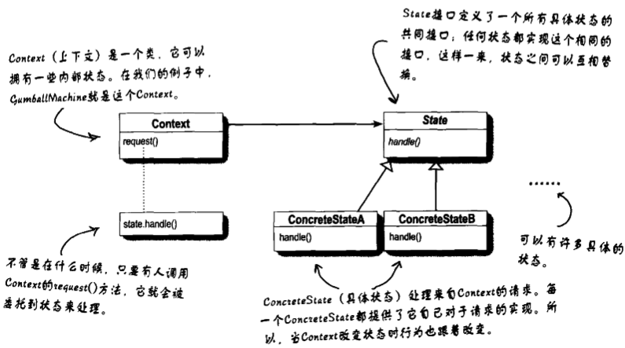

# 状态模式

策略模式：围绕可以互换的算法来创建成功业务

状态模式：通过改变对象内部的状态来帮助对象控制自己的行为

## 状态机（state machine）

1. 首先，找出所有的状态

2. 接下来，创建一个实例变量来持有目前的状态，然后定义每个状态的值

   ```java
   final static int SOLD_OUT=0;
   final static int NO_QUARTER=1;
   final static int HAS_QUARTER=2;
   final static int SOLD=3;
   
   int state=SOLD_OUT;
   ```

3. 现在，我们将所有系统中可以发生的动作整合起来

4. 状态机类中方法

   ```java
   public void insertQuarter()
   {
       if(state==HAS_QUARTER)
       {
           System.out.println("You can't insert another quarter");
       }
       else if(state==SOLD_OUT)
       {
           System.out.println("You can't insert a quarter, the machine is sold out");
       }
       else if(state==SOLD)
       {
           System.out.println("Please wait, we're already giving you a gumball");
       }
       else if(state==NO_QUARTER)
       {
           state=HAS_QUARTER;
           System.out.println("You inserted a quarter");
       }
   }
   ```

   

## 代码实现

```java
public class GumballMachine{
    //四个状态
    final static int SOLD_OUT=0;
    final static int NO_QUARTER=1;
    final static int HAS_QUARTER=2;
    final static int SOLD=3;
    
    //状态跟踪实例
    int state=SOLD_OUT;
    int count=0;//追踪机器内的糖果数目
    public GumballMachine(int count)
    {
        this.count=count;
        if(count>0)
        {
            state=NO_QUARTER;
        }
    }
    
    //当有25分钱投进来
    public void insertQuarter()
    {
         if(state==HAS_QUARTER)
        {
        System.out.println("You can't insert another  quarter");
        }
         else if(state==SOLD_OUT)
        {
        System.out.println("You can't insert a quarter, the machine is sold out");
        }
        else if(state==SOLD)
        {
        System.out.println("Please wait, we're already giving you a gumball");
        }
        else if(state==NO_QUARTER)
        {
        state=HAS_QUARTER;
        System.out.println("You inserted a quarter");
        }
     }
    //如果顾客试着退回25分钱
    public void ejectQuarter()
    {
        if(state==HAS_QUARTER){
            System.out.println("Quarter returned");
            state=NO_QUARTER;
        }
        else if(state==NO_QUARTER)
        {
            System.out.println("You haven't inserted a quarter");
        }
        else if(state==SOLD)
        {
            System.out.println("Sorry, you already turned the crank");
        }
        else if(state==SOLD_OUT)
        {
            System.out.println("You can't eject, you haven't inserted a quarter yet");
        }
    }
    
    //顾客试着转动曲柄
    public void turnCrank()
    {
        if(state==SOLD)
        {
            System.out.println("Turning twice doesn't get you another gumball!");
        }
        else if(state==NO_QUARTER)
        {
            System.out.println("You turned but there's no quarter");
        }
        else if(state==SOLD_OUT)
        {
            System.out.println("You turned, but there are no gumballs");
        }
        else if(state==HAS_QUARTER)
        {
            System.out.println("You turned...");
            state=SOLD;
            dispense();
        }
    }
    
    //发放糖果
    public void dispense(){
        if(state==SOLD)
        {
            System.out.println("A gumball comes rolling out the slot");
            count=count-1;
            if(count==0)
            {
                System.out.println("Oops, out of gumballs!");
                state=SOLD_OUT;
            }
            else
            {
                state=NO_QUARTER;
            }
        }
        else if(state==NO_QUARTER)
        {
            System.out.println("You need to pay first");
        }
        else if(state==SOLD_OUT)
        {
            System.out.println("No gumball dispensed");
        }
        else if(state==HAS_QUARTER)
        {
            System.out.println("No gumball dispensed");
        }
    }
    
    //其他方法
}
```

## 新的设计

不要维护现有代码，重写它以便于将状态对象封装在各自的类中，然后在动作发生时委托给当前状态。

1. 首先，我们定义一个State接口。在这个接口内，糖果机的每个动作都有一个对应的方法。
2. 然后为机器中的每个状态实现状态类。这些类将负责在对应的状态下进行机器的行为。
3. 最后，我们要摆脱旧的条件代码，取而代之的方式是，将动作委托到状态类。

### 1 定义状态接口和类

1. 首先，让我们创建一个State接口，所有的状态都必须实现这个接口：
2. 然后将设计中的每个状态都封装成一个类，每个都实现State接口。



还需要一个新的“赢家”状态（它也要实现State接口）：



### 2 状态类实现

从NoQuarterState开始：

```java
public class NoQuarterState implements State{
    GumballMachine gumballMachine;
    public NoQuarterState(GumballMachine gumballMachine)
    {
        this.gumballMachine=gumballMachine;
    }
    public void insertQuarter()
    {
        System.out.println("You inserted a quarter");
        gumballMachine.setState(gumballMachine.getHasQuarterState());
    }
    
    public void ejectQuarter()
    {
        System.out.println("You haven't inserted a quarter");
    }
    
    public void turnCrank()
    {
        System.out.println("You turned, but there's no quarter");
    }
    
    public void dispense()
    {
        System.out.println("You need to pay first");
    }
}
```

### 3 重新改造糖果机

```java
public class GumballMachine{
    State soldOutState;
    State noQuarterState;
    State hasQuarterState;
    State soldState;
    
    State state=soldOutState;
    int count=0;
    
    public GumballMachine(int numberGumballs)
    {
        soldOutState=new SoldOutState(this);
        noQuarterState=new NoQuarterState(this);
        hasQuarterState=new HasQuarterState(this);
        soldState=new SoldState(this);
        this.count=numberGumballs;
        if(numberGumballs>0)
        {
            state=noQuarterState;
        }
    }
    
    public void insertQuarter()
    {
        staet.insertQuarter();
    }
    
    public void ejectQuarter(){
        state.ejectQuarter();
    }
    public void turnCrank(){
        state.turnCrank();
        state.dispense();
    }
    void setState(State state)
    {
        this.state=staet;
    }
    
    void releaseBall()
    {
        System.out.println("A gumball comes rolling out the slot...");
        if(count!=0)
        {
            count=count-1;
        }
    }
    
    //这里有更多的方法，其中包括每一个状态的getter......
}
```

### 4 实现更多地状态

```java
public class HasQuarterState implements State{
    GumballMachine gumballMachine;
    
    public HasQuarterState(GumballMachine gumballMachine)
    {
        this.gumballMachine=gumballMachine;
    }
    
    pubilc void insertQuarter()
    {
        System.out.println("You can't insert another quarter");
    }
    
    public void ejectQuarter()
    {
        System.out.println("Quarter returned");
        gumballMachine.setState(gumballMachine.getNoQuarterState());
    }
    
    public void turnCrank()
    {
        System.out.println("You turned...");
        gumballMachine.setState(gumballMachine.getSoldState());
    }
    
    public void dispense()
    {
        System.out.println("No gumball dispensed");
    }
}
```

### 5 重构以后的改进点

1. 将每个状态的行为局部化到它自己的类中
2. 将容易产生问题的if语句删除，以方便日后的维护
3. 让每一个状态“对修改关闭”，让糖果机“对扩展开放”，因为可以加入新的状态类（我们马上就这么做）。
4. 创建一个新的代码基和类结构，这更能映射万能糖果公司的图，而且更容易阅读和理解。


## 状态模式定义

允许对象在内部状态改变时改变它的行为，对象看起来好像修改了它的类。



### 1 状态模式要点

1. 状态模式允许一个对象基于内部状态而拥有不同的行为
2. 和程序状态机（PSM）不同，状态模式用类代表状态
3. Context会将行为委托给当前状态对象
4. 通过将每个状态封装进一个类，我们把以后需要做的任何改变局部化了。
5. 状态模式和策略模式有相同的类图，但是它们的意图不同
6. 策略模式通常会用行为或算法来配置Context类
7. 状态模式允许Context随着状态的改变而改变行为
8. 状态转换可以有State类或Context类控制
9. 使用状态模式通常会导致设计中类的数目大量增加
10. 状态类可以被多个Context实例共享

