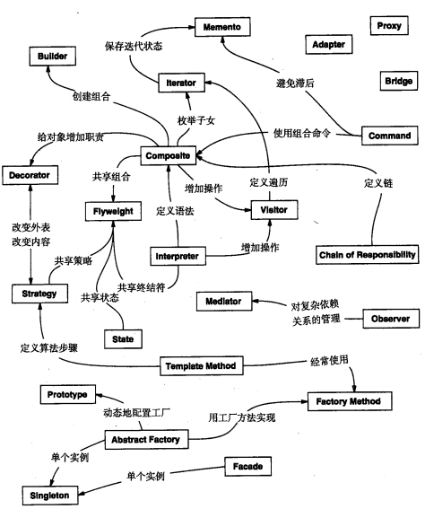

# 模式概念

基本要素：

1. 模式名称（pattern name）
2. 问题（problem）
3. 解决方案（solution）
4. 效果（consequences）

对被用来在特定场景下解决一般设计问题的类和相互通信的对象的描述

# 设计模式的编目

Abstract Factory：提供一个创建一系列相关或相互依赖对象的接口，而无需指定它们具体的类。

Adapter：将一个类的接口转换成客户希望的另外一个接口。Adapter模式使得原本由于接口不兼容而不能一起工作的那些类可以一起工作。

Bridge：将抽象部分与它的实现部分分离，使他们都可以独立地变化。

Builder：将一个复杂对象的构建与它的表示分离，使得同样的构建过程可以创建不同的表示。

Chain of Responsibility：为解除请求的发送者和接收者之间耦合，而使多个对象都有机会处理这个请求。将这些对象连成一条链，并沿着这条链传递该请求，直到有一个对象处理它。

Command：将一个请求封装为一个对象，从而使你可用不同的请求对客户进行参数化；对请求排队或记录请求日志，以及支持可取消的操作。

Composite：将对象组合成树形结构以表示“部分-整体”的层次结构。Composite使得客户对单个对象和复合对象的使用具有一致性。

Decorator：动态地给一个对象添加一些额外的指责。就扩展功能而言，Decorator模式比生成子类方式更为灵活。

Facade（外观）：为子系统中的一组接口提供一个一致的界面，Facade模式定义了一个高层接口，这个接口使得这一子系统更加容易使用。

Factory Method：定义一个用于创建对象的接口，让子类决定将哪一个类实例化。Factory Method使一个类的实例化延迟到其子类。

Flyweight：运用共享技术有效地支持大量细粒度地对象。

Interpreter：给定一个语言，定义它地文法地一种表示，并定义一个解释器，该解释器使用该表示来解释语言中的句子。

Iterator：提供一种方法顺序访问一个聚合对象中各个元素，而又不需暴露该对象的内部表示。

Mediator：用一个中介对象来封装一系列的对象交互。中介者使各对象不需要显式地相互引用，从而使其耦合松散，而且可以独立地改变它们之间地交互。

Memento：在不破坏封装性地前提下，捕获一个对象地内部状态，并在该对象之外保存这个状态。这样以后就可将该对象恢复到保存的状态。

Observer：定义对象间地一种一对多的依赖关系，以便当一个对象的状态发生改变时，所有依赖于它的对象都得到通知并自动刷新。

Prototype：用原型实例指定创建对象的种类，并且通过拷贝这个原型来创建新的对象。

Proxy：为其他对象提供一个代理以控制对这个对象的访问。

Singleton：保证一个类仅有一个实例，并提供一个访问它的全局访问点

State：允许一个对象在其内部状态改变时改变它的行为。对象看起来似乎修改了它所属的类。

Strategy：定义一系列的算法，把它们一个个封装起来，并且使它们可相互替换。本模式使得算法的变化可独立于使用它的客户。

Template Method：定义一个操作中的算法的骨架，而将一些步骤延迟到子类中。Template Method使得子类可以不改变一个算法的结构即可重定义该算法的某些特定步骤。

Visitor：表示一个作用于某对象结构中的各元素的操作。它使你可以在不改变各元素的类的前提下定义作用于这些元素的新操作。

 ## 模式关系图

# 设计模式 解决问题步骤

1. 寻找合适的对象

   > 客户请求是使对象执行操作的唯一方法，操作又是对象改变内部数据的唯一方法

2. 决定对象的粒度

   > Facade模式描述了怎样用对象表示完整的子系统
   >
   > Flyweight模式描述了如何支持大量的最小粒度的对象

3. 指定对象接口

   > 对象操作所定义的所有操作型构的集合

4. 描述对象的实现

   > 对象通过实例化类来创建
   >
   > (竖线和三角表示子类关系)
   >
   > **针对接口编程，而不是针对实现编程**

5. 运用复用机制

# 创建型模式

创建型模式抽象了实例化过程。它们帮助一个系统独立于如何创建、组合和表示它的那些对象。一个类创建型模式使用继承改变被实例化的类，而也给对象创建型模式将实例化委托给另一个对象。

