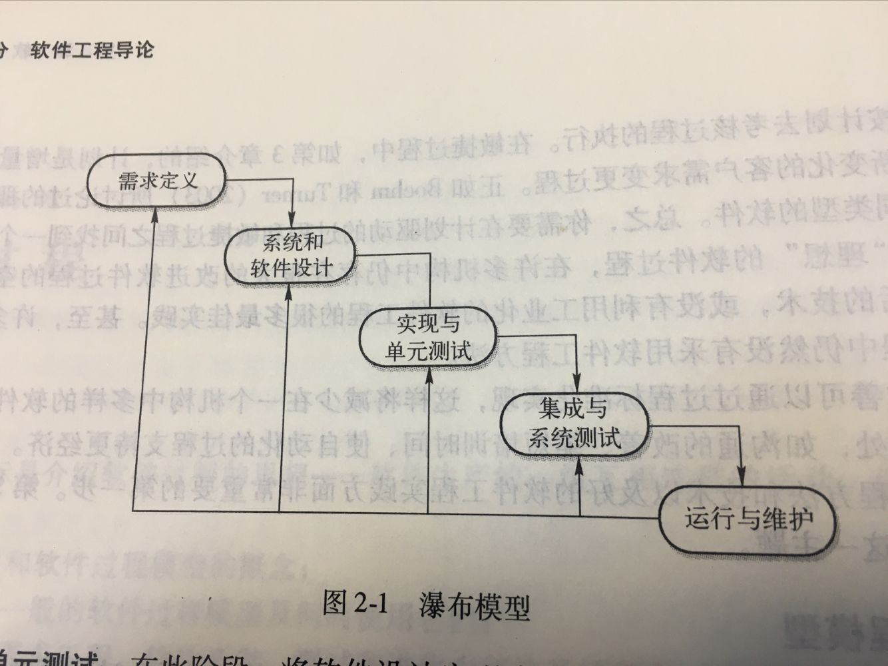
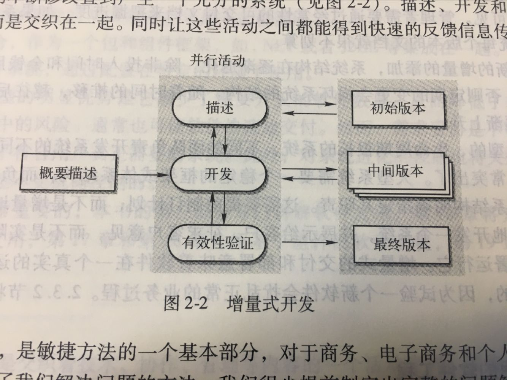
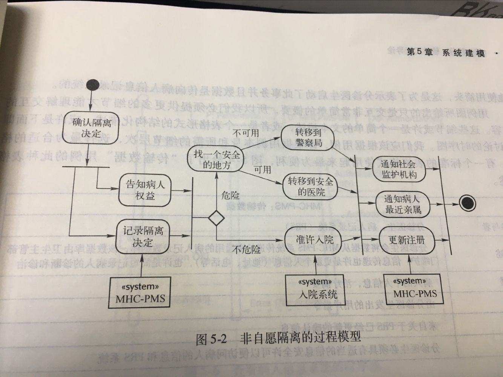
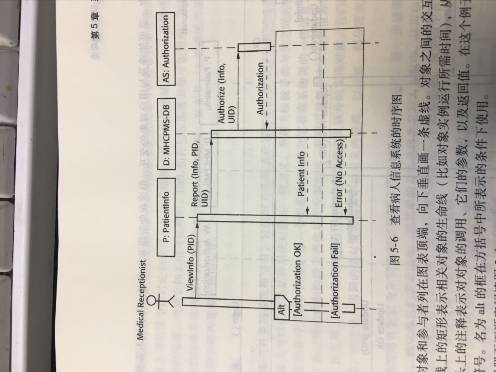

# 1 软件过程

1. 软件描述
2. 软件设计与实现
3. 软件有效性验证
4. 软件进化

## 1.1 软件过程模型

### 1.1.1 瀑布模型

计划驱动的软件过程

1. 需求定义
2. 系统和软件设计
3. 实现与单元测试
4. 集成与系统测试
5. 运行与维护

### 1.1.2 增量式开发

先开发出一个初始的实现，给用户使用并听取用户的使用意见和建议，通过对多个版本的不断修改直到产生一个充分的系统。

### 1.1.3 面向复用的软件工程

1. 组件分析
2. 需求修改
3. 使用复用的系统设计
4. 开发和集成

## 1.2 敏捷开发

敏捷开发、极限编程(XP)

> 小团队适用，需要对代码、项目的理解程度高，沟通顺畅

# 2 需求工程

对服务和约束的发现、分析、建立文档、检验的过程叫做需求工程。

## 2.1 功能需求和非功能需求

### 2.1.1 功能需求

描述系统所提供的功能或服务。

### 2.1.2 非功能需求

不直接关系到系统向用户提供的具体服务的一类需求。

## 2.2 需求工程过程

1. 系统可行性研究

   > 评估系统是否对业务有用

2. 需求导出和分析

   > 需求发现

3. 需求描述

   > 将需求转变为某种标准格式描述

4. 需求有效性验证

   > 检验需求是否正确地定义了客户所希望的系统

# 3 系统建模

UML使用者认为5种类型的图就可以表示出一个系统的本质：

1. 活动图

   > 表示一个过程或数据处理中所涉及的活动

2. 用例图

   > 一个系统和它所处环境之间的交互

3. 时序图

   > 参与者和系统之间以及这些类之间的联系

4. 类图

   > 系统中的对象类以及这些类之间的联系

5. 状态图

   > 系统如何响应内部和外部事件

## 3.1 上下文模型

圆边矩形表示活动（必须得到执行的一个子过程）

PS：

* 来自多个活动的流导向一个实心条时，那么只有这些活动均完成时过程才能运行。
* 来自实心条的流导向多个活动时，这些活动应同时执行

## 3.2 交互模型

### 3.2.1 用例建模

为系统与外部参与者（用户或其他系统）之间的交互建模

### 3.2.2 时序图

表示在特定用例中的交互发生顺序。

## 3.3 结构模型

系统的构成，表示为组件构成系统以及组件之间的关系。

### 3.3.1 类图

表示系统中的类和这些类之间的关联。

### 3.3.2 泛化

允许我们推断这些类的成员具有某些共同的特征。针对类的所有成员给出一般性的描述。

### 3.3.3 聚合

一个对象可以由其他对象组成（全体——部分）

## 3.4 行为模型

P83

## 3.5 模型驱动工程

类似UE4的蓝图

