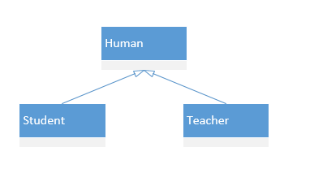
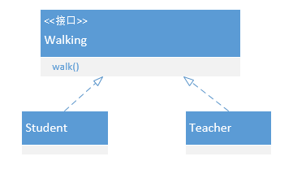

# UML 类关系

## 1 依赖（Dependency）

虚线+箭头

主要体现：

类A的某个成员函数的返回值、形参、局部变量或静态方法的调用（类A引用了类B）

## 2 关联（Association）

实线+箭头

1. 类Teacher成为类Student的属性
2. 从关系的生命周期来看，依赖关系是仅当类的方法被调用时而产生，伴随着方法的结束而结束。关联关系当类实例化的时候产生，当类对象销毁的时候关系结束。相比依赖，关联关系的生存期更长。

## 3 聚合（Aggregation）

实线+空心菱形

集体与个体之间的关联

类Student成为类Classes的成员变量

## 4 组合（Composition）

实线+实心菱形

类Heart成为类Student的成员变量

## 5 泛化（Generalization）

类与类之间的继承关系和类与接口之间的实现关系

继承关系：直线+空心三角形

接口关系：虚线+空心三角形

